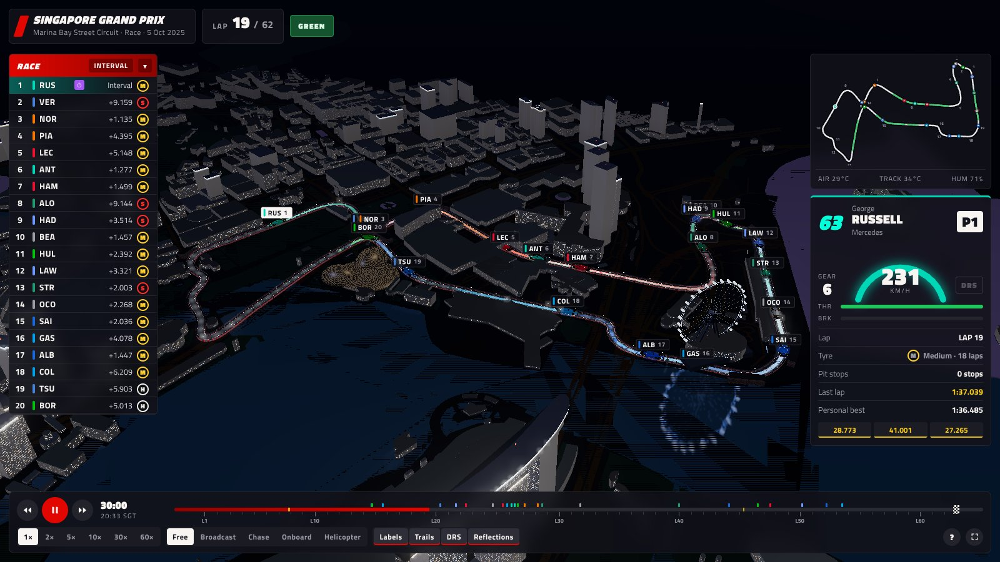
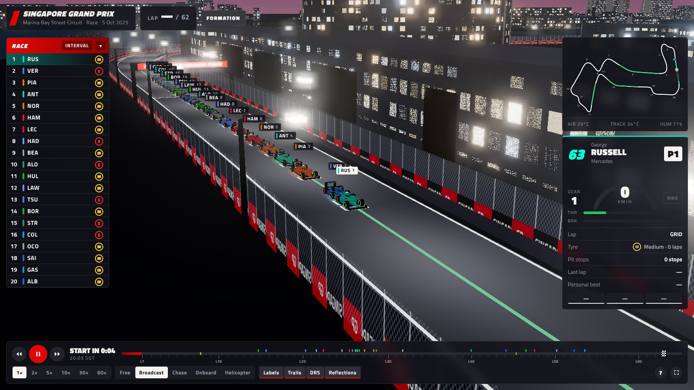

# Marina Bay Night Race — 3D replay

An interactive, stylised 3D map of the **Marina Bay Street Circuit** with a full replay of the
**2025 Singapore Grand Prix** (5 Oct 2025, won by George Russell), plus sessions from the
2026 weekend as their data is published (FP1 and Sprint Qualifying so far). All 20 cars move along the
paths they actually drove, using the recorded car-location telemetry. The city around the track is
built from real OpenStreetMap footprints.





## What's in it

- **Real driver movements.** OpenF1 car location data (~3.7 Hz) for every driver, from the grid
  through the formation lap and the race to the cool-down lap. Positions are resampled to 4 Hz and
  smoothed with Catmull-Rom splines between samples. Speed, gear, throttle, brake and DRS come from
  the car telemetry channel.
- **Real geography.** The telemetry frame is fitted to the OpenStreetMap circuit with an ICP fit
  (about 4 m RMS), so the cars, track, buildings, Marina Bay, the Singapore Flyer, Marina Bay Sands
  and the Esplanade domes all line up.
- **Track built from the data.** The centreline is averaged from hundreds of clean laps. Elevation
  comes from the telemetry z-channel, DRS zones from where cars actually opened DRS, and the grid
  boxes from where cars actually lined up. The 19 official corner numbers come from MultiViewer's
  circuit data.
- **F1 broadcast styling.** F1 red, carbon and white. The timing tower shows interval or gap to the
  leader, tyre compound and age, pit status, fastest lap (purple) and the chequered flag. There is
  also a driver telemetry card with sector colours (purple, green, yellow), a minimap, race-control
  and overtake toasts, a lap-marked timeline with pit stops and yellow flags, and five start lights
  on the gantry that go out at the real lights-out time.
- **Cameras.** Free orbit, automatic **Broadcast** cuts between trackside cameras, **Chase**, **Onboard**
  (T-cam) and **Helicopter**.
- **Night look.** Floodlit asphalt with light pools, light towers, lit windows, aircraft beacons,
  water reflections, bloom and team-coloured light trails.
- **Hand-built landmarks** (`src/skyline.js`), modelled from the reference photos in `reference/`
  (Wikimedia Commons, credited in each `SOURCES.md`) on their OSM footprints: Marina Bay Sands (legs
  on an arc, cream structural edges, boat-shaped SkyPark with a lit underside and the north
  cantilever), the ArtScience Museum lotus, the Singapore Flyer and terminal, the two Esplanade
  shells (different sizes, warm sunshade lattice), UOB Plaza One and Two (stepped faceted crowns),
  the Supreme Court saucer, the National Gallery (Old Supreme Court and City Hall), the Padang with
  the Cricket Club and Recreation Club, St Andrew's Cathedral and The Fullerton Hotel. Before /
  after screenshots are in `qa/landmarks/`.
- **The rest of the city** is extruded from real OSM footprints and heights. OSM use / heritage /
  roof tags (`scripts/fetch_building_tags.py`) pick the facade: office ribbons, hotel rooms,
  flats, heritage shophouses with clay-tile roofs; windows are banded by floor with dark floors.
  Roofs are dark with plant rooms, parapet lights and water tanks; the tallest towers carry red
  aviation lights. Untagged blocks far from the circuit are plain filler.
- **Bridges and viaducts**: Anderson and Esplanade Bridge, which the circuit drives over
  (`src/bridges.js`), and the elevated East Coast Parkway / Benjamin Sheares Bridge decks it passes
  under at T1, T4-T5 and T17, plus the Helix, Jubilee and Cavenagh bridges (`src/viaducts.js`, from
  OSM via `scripts/fetch_bridges.py`). Overhead decks are real geometry, so they hide cars from every
  camera; each span is a shade zone and is lit from the deck soffit.
- **Pit complex, crowds, cars**: a three-level pit building with garages, Paddock Club, rooftop
  deck and backlit SINGAPORE lettering (`src/pit.js`); ~21k instanced spectators that wave and flash
  phone lights as cars pass (`src/crowd.js`); detailed cars in clean team colours, numbers, brake
  glow and kerb sparks. Sponsor decals (`LIVERY_DECALS`) are only drawn for a team whose livery has
  reference images in `config.LIVERIES`, and only when the car is big enough on screen.
- **Trackside boards** show the sponsors' logo files (`assets/logos/`, fetched from Wikimedia Commons
  by `scripts/fetch_logos.py`) on each brand's board colour; a brand without a file falls back to a
  text wordmark. Colours, liveries, landmarks, bridge zones and crowd density live in `src/config.js`.

## Controls

| Key | Action |
| --- | --- |
| `Space` | Play / pause |
| `←` / `→` | Seek ±10 s |
| `↑` / `↓` | Focus the driver ahead / behind |
| `1`–`5` | Camera: Free, Broadcast, Chase, Onboard, Helicopter |
| `F` | In Free cam, keep orbiting around the focused car |

Click a driver in the tower, on the minimap or on their 3D label to focus them. Drag the timeline to
scrub. You can replay at 1×, 2×, 5×, 10×, 30× or 60×.

## Run locally

It's a static site with no build step. Three.js loads from jsDelivr through an import map.

```bash
python3 -m http.server 8000
# open http://localhost:8000
```

## Sessions and rebuilding the data

Each session is built into its own folder under `data/` and listed in `data/sessions.json`.
The picker in the header switches between them, and a link can open one directly with
`#<id>` (for example `#2026-fp1`).

OpenF1's free API publishes a session's data a few minutes after the session ends. A live
feed while cars are on track would need OpenF1's paid real-time access and a small relay
server, so these are replays rather than live views. To add a session (find the key with
`https://api.openf1.org/v1/sessions?country_name=Singapore&year=2026`):

```bash
pip install numpy scipy
python3 scripts/fetch_data.py --session 11378            # -> raw/11378 (+ raw/common, git-ignored)
python3 scripts/build_data.py --session 11378 --id 2026-fp1 --label "2026 FP1" \
    --track-from data/2025-race/race.json                # reuse the race's track geometry
```

The track geometry (centreline, kerbs, corners, DRS zones) is built from the 2025 race laps:
`--session 9896 --id 2025-race --label "2025 Race" --city`, which also rebuilds `data/city.json`.
Other sessions on the same layout reuse it with `--track-from`. Races (and sprints) get a grid, start
lights and a lap counter; practice and qualifying get a best-lap timing tower and a session clock.
Knockout qualifying shows the Q1/Q2/Q3 clock (paused during red flags), the live elimination
cut line and greys out eliminated drivers. Sessions that overrun (red flags, delays) are fetched up
to their last chequered flag.
2026 cars have no DRS, so DRS zones and the DRS badge are hidden for 2026 sessions.

`race.bin` is `int16[driver][frame][4]` at 4 Hz: `f0, f1, speed_kph, packed`, where `packed` holds
throttle (7 bits), gear << 7, DRS << 11, brake << 12 and on-track << 13. On track, `f0` is the
distance along the centreline (uint16, dm) and `f1` the lateral offset (cm); both are fitted with
smoothing splines, so cars follow the circuit's curve without sample jitter. Off track (pit lane,
garage), `f0`/`f1` are x/y in dm, local metres east/north.

## Project layout

```
index.html, styles.css   page shell + broadcast UI styling
src/data.js              data loading and race-state queries (positions, gaps, tyres, timing)
src/world.js             sky, ground, water reflections, roads, parks, buildings, landmarks
src/track.js             track surface, kerbs, walls/fences, light towers, gantry, pit lane, stands
src/cars.js              car models, telemetry-driven motion, trails, labels
src/camera.js            camera director (orbit / broadcast / chase / onboard / heli)
src/ui.js                timing tower, driver card, minimap, timeline, toasts
scripts/                 data fetch + build pipeline
```

## Credits

- Timing and telemetry: [OpenF1](https://openf1.org)
- Map data: © [OpenStreetMap](https://www.openstreetmap.org/copyright) contributors (ODbL)
- Corner positions: [MultiViewer](https://multiviewer.app) circuit API

This is an unofficial fan project. It is not associated with Formula 1 companies. F1, FORMULA ONE
and related marks are trademarks of Formula One Licensing B.V.
